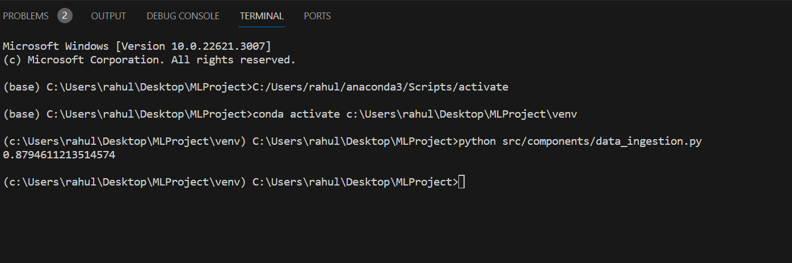
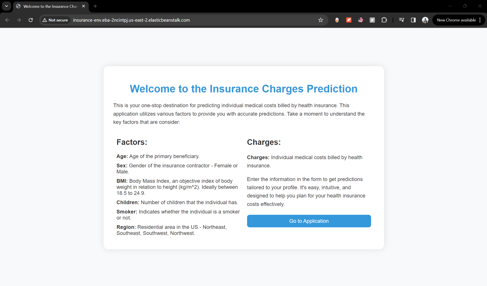
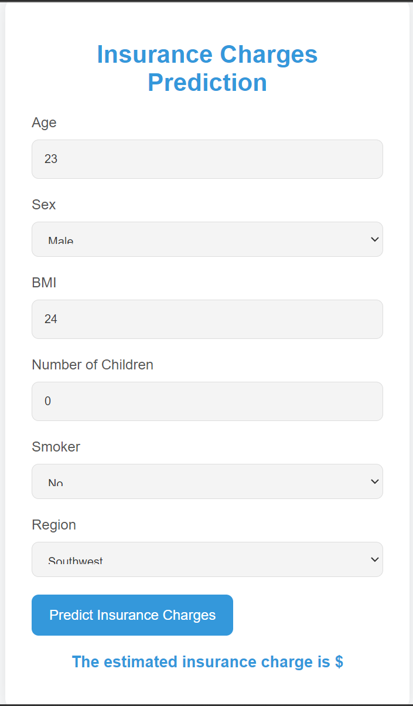
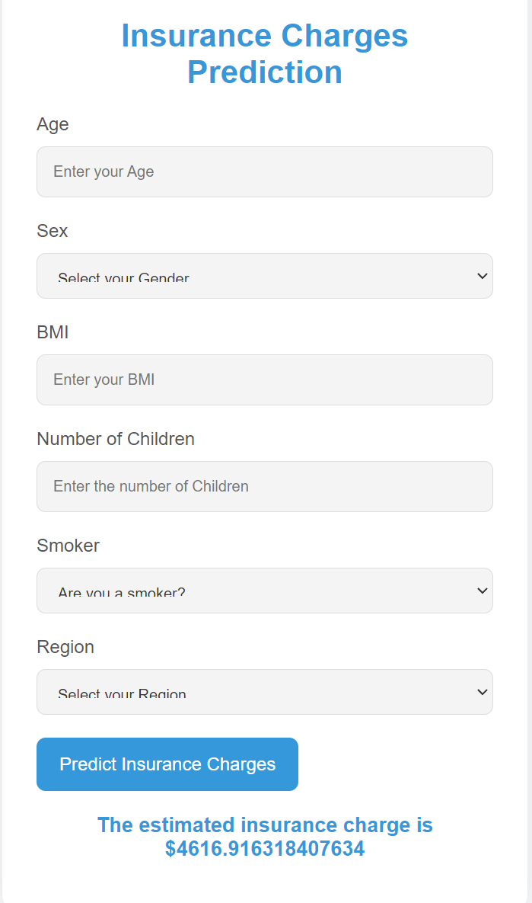
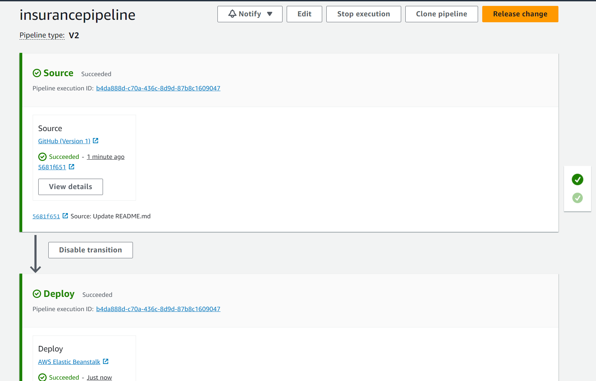

## End to End Insurance Rate Prediction Using Machine Learning

Welcome to the Insurance Charges Prediction project! This application predicts individual medical costs billed by health insurance using various factors such as age, gender, BMI, number of children, smoking status, and residential region.

### Model Training
The model training script is implemented in model_trainer.py. This script uses various regression models such as Random Forest, Decision Tree, Gradient Boosting, Linear Regression, XGBoost, CatBoost, and AdaBoost to predict insurance charges. The best model at the end of training is choosen and the model is saved. This model is then used in the application.

### AWS Deployment
This project is designed to be easily deployed on AWS Elastic Beanstalk. You can leverage AWS CodePipeline to connect your GitHub repository to AWS Beanstalk for continuous deployment.
- Configure AWS Elastic Beanstalk:
    - Set up an Elastic Beanstalk environment for the application.
- Configure AWS CodePipeline
  - Create a new CodePipeline in the AWS Management Console.
  - Connect the pipeline to your GitHub repository.
  - Define the source and deploy stages in the pipeline, specifying Elastic Beanstalk as the deployment provider.
- Deployment
    - Push changes to your GitHub repository, and CodePipeline will automatically trigger the deployment process to AWS Beanstalk.

### Usage
- Ensure you have the required dependencies installed: **
  - pip install -r requirements.txt
- Run the model training script 
  - python src/components/data_ingestion.py
- Run the webapplication 
  - python app.py

### Demo

#### Model Training

#### Home Page

#### Prediction Page

#### AWS Deployment

